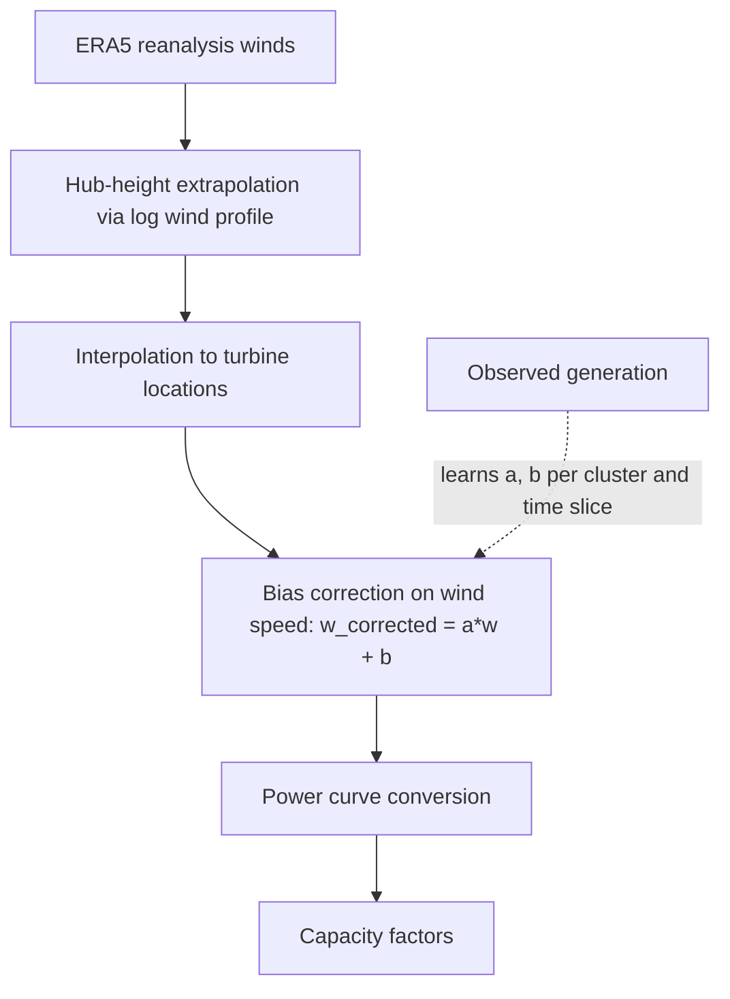

# The Python Virtual Wind Farm (PyVWF) model

[](https://github.com/ellyess/PyVWF/actions/workflows/ci.yml)
[](https://www.python.org/)
[](LICENSE)
[](https://doi.org/10.5281/zenodo.21236619)

PyVWF turns atmospheric reanalysis (ERA5) into bias-corrected wind power
generation. It is a Python rewrite of the
[VWF model](https://github.com/renewables-ninja/vwf) by Iain Staffell, which
underpins the wind simulations on
[Renewables.ninja](https://www.renewables.ninja/), and it implements the
granular bias-correction method of
[Benmoufok et al. (2024)](https://doi.org/10.1016/j.energy.2024.133759).

Raw reanalysis winds carry systematic, location-dependent biases, so capacity
factors simulated straight from ERA5 drift away from what fleets actually
generate. PyVWF learns a per-cluster, per-time-slice linear correction of the
**wind speed** (`w_corrected = a*w + b`) from observed generation, then converts
the corrected wind to power. Unlike API-only tools, it exposes the full
*training* workflow, so the factors are yours to inspect, map and retrain at
whatever spatial and temporal resolution your observations support.



The correction is applied to the wind speed, before the power-curve conversion,
so the non-linear speed-to-power step operates on corrected winds. The framework
targets daily to monthly analysis at turbine, regional or national scale.

Adding a region means writing one observation adapter and one TOML config, with
no change to the correction maths, the clustering or the curves. Every run
writes a `run_manifest.json` recording the package version, git state, region
config, and the identity and hashes of the curve library behind the numbers.

## Installation

```bash
git clone https://github.com/ellyess/PyVWF.git
cd PyVWF
conda env create -f environment.yaml && conda activate pyvwf
```

Or into any Python >= 3.10 environment:

```bash
pip install -e .            # simulate, bias-correct, evaluate, plot
pip install -e ".[data]"    # + ENTSO-E client and Excel/Parquet readers
pip install -e ".[dev]"     # + pytest, ruff, mypy
pip install -e ".[docs]"    # + sphinx, myst-parser
pip install -e ".[pinn]"    # + torch, for the experimental physics-informed correction
```

PyVWF reads inputs from `input/` in the working directory; set `PYVWF_INPUT` to
point elsewhere. It bundles an open turbine curve library (69 real machines plus
7 composites from NREL/turbine-models, BSD-3-Clause, VWF-smoothed) so it runs on
real curve physics out of the box, matching fleets by specific power and warning
whenever it falls back. Turbine metadata and observed generation are not shipped,
because such datasets are usually proprietary. See
[data sources](docs/guides/data-sources.md) for the full input layout.

## Quickstart

No downloads, about a minute, synthetic weather and observations:

```bash
python examples/run_minimal.py
```

With your own data, through the `pyvwf-train` console script:

```bash
pyvwf-train --outdir outputs/demo_DK_2020 --country DK --year-test 2020 --calc-z0
```

This trains the correction factors, simulates the test year, and writes metrics
and diagnostic plots. `--help` lists the options: `--cluster-mode`,
`--cluster-list`, `--time-res-list` and the rest.

The validation harness handles one region at a time from its config:

```bash
python scripts/analysis/validate_region.py train --region configs/regions/nz.toml
python scripts/analysis/validate_region.py evaluate --region configs/regions/nz.toml \
    --train-run output/validation/NZ/train-<timestamp>
```

`transfer` is the third verb: it applies one region's factors to another. See
the [training guide](docs/guides/training.md).

`vwf.viz` turns a run into diagnostic figures, from distribution and QQ plots to
maps of what the correction learned per cluster. See the
[visualisation guide](docs/guides/visualisation.md), or run
`python examples/viz_demo.py` for a data-free reproduction of all six.


## Validated regions

Fitted and scored against observed generation, best held-out configuration,
capacity-factor RMSE uncorrected to corrected. All figures were re-run on v0.4.0;
the [scorecard](docs/findings/scorecard.md) gives the source path for each.

| Region | Fleet (test) | RMSE | Region | Fleet (test) | RMSE |
|---|---|---|---|---|---|
| Germany | 4,814 turbines | 0.086 → **0.057** | Australia (NEM) | 77 farms | 0.115 → **0.094** |
| Denmark | 5,410 turbines | 0.147 → **0.085** | United Kingdom | 348 turbines | 0.145 → **0.115** |
| Brazil † | 151 complexes | 0.139 → **0.105** | New Zealand | 12 farms | 0.157 → **0.106** |
| United States † | 520 plants | 0.110 → **0.097** | Chile † | 59 plants | 0.123 → **0.105** |
| Argentina † | 59 plants | 0.151 → **0.133** | | | |

**† Degenerate fit.** The aggregate metric is real, but the per-cluster factors
contain implausible wind scalars, worst in Chile at 80.23 and the United States
at 46.39. Do not reuse the factors from these four.

**National level** (ENTSO-E aggregate, held-out 2023, all eight clean): France
0.171 → **0.012**, Belgium 0.340 → **0.020**, Spain 0.135 → **0.026**, Ireland
0.172 → **0.021**, Sweden 0.088 → **0.030**, Italy 0.066 → **0.034**, Portugal
0.110 → **0.074**.

**Where it does not work.** Norway is close to unbiased uncorrected and the
correction makes it worse (0.034 → 0.039). The Netherlands is excluded: an
ENTSO-E coverage defect caps its reported capacity factor and no rescaling
repairs it. Chile and Argentina remove the mean bias but add limited skill,
because ERA5 exaggerates the north-south wind gradient in both. The United
States carries an unscreened ERCOT/SPP curtailment confound. Each is written up
in [docs/findings/](docs/findings/).

## Documentation

Hosted at [pyvwf.readthedocs.io](https://pyvwf.readthedocs.io/), and readable as
plain Markdown in [`docs/`](docs/README.md).

- [Data sources and preprocessing](docs/guides/data-sources.md): input formats, sources per region, preprocessing.
- [Training and evaluation](docs/guides/training.md): the region config, and train / evaluate / transfer.
- [Output structure](docs/guides/output-structure.md): what a run directory contains.
- [Visualisation](docs/guides/visualisation.md): the `vwf.viz` figures.
- [Adding an observation source](docs/guides/adding-an-observation-source.md): the adapter contract.
- [Using your own data](docs/guides/your-own-data.md): running the correction on a CSV fleet.
- [Region runbooks](docs/runbooks/): acquisition and processing per region.
- [Harness design](docs/design/harness.md): why the seams are where they are.
- [Findings](docs/findings/): the validation results, including the negative ones.
- [PIPELINE.md](PIPELINE.md): script execution order.

## Physics-informed correction (experimental)

`vwf.pinn` is a research alternative to the affine correction, aimed at the case
where a region has no observed generation to fit against. It replaces the fitted
per-cluster factors with four bounded physical quantities (terrain speed-up,
shear-exponent offset, conversion efficiency, sub-daily wind spread) learned
inside a differentiable forward operator and supervised directly on observed
capacity factor. Zero-shot on nine regions it never saw, it improves on
uncorrected ERA5 where a statistical transfer of the affine factors does harm.
It is not wired into the harness and has no stable API, and it needs the
optional `[pinn]` extra. Method, gates and results, including four refuted
hypotheses, are in
[docs/findings/method-physics-informed.md](docs/findings/method-physics-informed.md).

## Limitations

- Bias correction here is statistical, not physical. Wake effects are not
  explicitly modelled, and power-curve choice strongly influences results.
- ERA5's spatial resolution limits turbine-level accuracy, and accuracy depends
  on the quality and representativeness of the observations.
- **One held-out test year per region.** The reportable result is the drop from
  uncorrected to corrected. Orderings between two close configurations are not
  meaningful, and neither is the exact best cluster count.
- **Screening-level, not an accredited yield assessment.** Nothing here is
  MEASNET or DNV accredited, and none of it is investment advice.
- **The correction does not always help**, as the table above records.
- **Country-level offsets are under-determined.** Fitted against one national
  series per month, they largely repair the scalar's cube-law overshoot rather
  than capturing an additive spatial bias
  ([method-country-level.md](docs/findings/method-country-level.md)).

Dependencies are pinned in `environment.yaml` and methods are deterministic
where possible. For published work, document the ERA5 version, the training
period and the power-curve source alongside the citation.

## Citation

Please cite both the software and the method paper. The Zenodo DOI below is the
*concept* DOI and always resolves to the latest release; for the exact version
you ran, take the version-specific DOI from the
[record](https://doi.org/10.5281/zenodo.21236619).

> Benmoufok, E. F., Warder, S. C., and Piggott, M. D. *PyVWF: An open Python
> framework for bias-corrected wind power simulation from reanalysis data.*
> Zenodo. [doi:10.5281/zenodo.21236619](https://doi.org/10.5281/zenodo.21236619)

> Benmoufok, E. F., Warder, S. C., Zhu, E., Bhaskaran, B., Staffell, I., and
> Piggott, M. D. (2024). *Improving wind power modelling through granular
> spatial and temporal bias correction of reanalysis data.* Energy.
> [doi:10.1016/j.energy.2024.133759](https://doi.org/10.1016/j.energy.2024.133759)

The method is also applied in Wang et al. (2026), *Energy Conversion and
Management*, [doi:10.1016/j.enconman.2026.121066](https://doi.org/10.1016/j.enconman.2026.121066).
Machine-readable metadata is in [`CITATION.cff`](CITATION.cff).

## Contributing

Contributions are welcome, especially documentation, new bias-correction
methods, validation case studies and performance work. See
[CONTRIBUTING.md](CONTRIBUTING.md) for development setup, tests and pull-request
guidelines, and open an issue to discuss larger changes first.

## Credits and contact

PyVWF is developed by Ellyess F. Benmoufok (benmoufok.ellyess@gmail.com). The
original VWF model is by Iain Staffell (i.staffell@imperial.ac.uk). PyVWF is
part of the [Renewables.ninja](https://renewables.ninja) project, developed by
Stefan Pfenninger and Iain Staffell.
