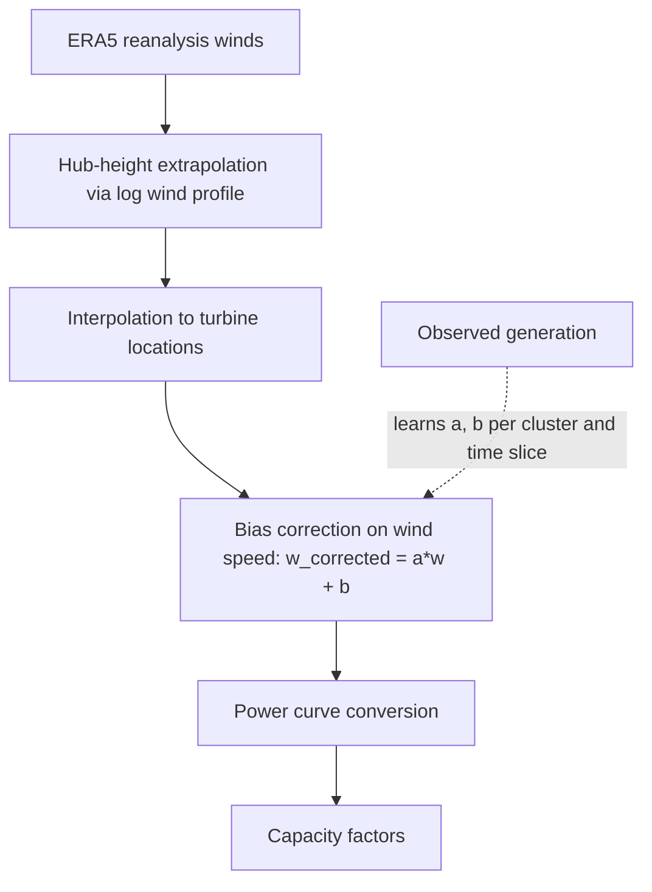

# The Python Virtual Wind Farm (PyVWF) model

[](https://github.com/ellyess/PyVWF/actions/workflows/ci.yml)
[](https://pyvwf.readthedocs.io/en/latest/)
[](https://www.python.org/)
[](LICENSE)
[](https://doi.org/10.5281/zenodo.21236619)

PyVWF turns atmospheric reanalysis (ERA5) into bias-corrected wind power
generation. It is a Python rewrite of the
[VWF model](https://github.com/renewables-ninja/vwf) by Iain Staffell, which
underpins the wind simulations on
[Renewables.ninja](https://www.renewables.ninja/), and it implements the
granular bias-correction method of
[Benmoufok et al. (2024)](https://doi.org/10.1016/j.energy.2024.133759).

Raw reanalysis winds carry systematic, location-dependent biases, so capacity
factors simulated straight from ERA5 drift away from what fleets actually
generate. PyVWF learns a per-cluster, per-time-slice affine correction of the
**wind speed** (`w_corrected = a*w + b`) from observed generation, then converts
the corrected wind to power, so the non-linear speed-to-power step operates on
corrected winds. Unlike API-only tools, it exposes the full *training*
workflow, so the factors are yours to inspect, map and retrain at whatever
spatial resolution and time slice your observations support. Results here are
improved on rather than preserved: a recorded output is superseded by a better
one, and the code state behind each published result is kept in
[publications.md](docs/publications.md) so the number can still be read.



Every run writes a manifest recording the package version, the git state, the
region config and the curve library behind the numbers, and
[`vwf.viz`](docs/guides/visualisation.md) turns it into diagnostic figures,
including maps of what the correction learned per cluster.

## Installation

```bash
conda env create -f environment.yaml && conda activate pyvwf
```

Or into any Python >= 3.10 environment, `pip install -e .`. Six extras add
data acquisition, the development tools, the docs build, the gridded surfaces,
the physics-informed correction and the TouchDesigner export; the
[installation guide](docs/guides/installation.md) says what each needs, and a
[Docker image](docs/guides/docker.md) carries the scientific stack ready built.

## Quickstart

No downloads, a few seconds, synthetic weather and observations:

```bash
python examples/run_minimal.py
```

With your own data, `pyvwf-validate` runs one region through the harness, the
preferred path, from its config in `configs/regions/`:

```bash
pyvwf-validate train --region configs/regions/nz.toml
pyvwf-validate evaluate --region configs/regions/nz.toml \
    --train-run output/validation/NZ/train-<timestamp>
```

`transfer` is the third verb: it applies one region's factors to another. See
the [training guide](docs/guides/training.md), and `pyvwf-validate --help`.

## Documentation

Hosted at [pyvwf.readthedocs.io](https://pyvwf.readthedocs.io/), and readable as
plain Markdown in [`docs/`](docs/README.md), which indexes every page.

- [Data sources and preprocessing](docs/guides/data-sources.md): input formats, sources per region, preprocessing.
- [Training and evaluation](docs/guides/training.md): the region config, the input root, and train / evaluate / transfer.
- [Adding a region](docs/guides/adding-a-region.md): every file a new region touches, in order.
- [Adding a study](docs/guides/adding-a-study.md): where a study's documents, driver and runs go.
- [Findings](docs/findings/): the validation results, including the negative ones.

## Results

The correction is fitted and scored against observed generation in fifteen
regions on four continents, each on training years and a single test year it
never saw. It lowers capacity-factor RMSE in all nine turbine-level fleets. In
the country-level fleets, simulated on each grid's representative turbine, it
lowers RMSE in five of six and raises it in France; Italy and Portugal are
suspended, because on that turbine's curve most of their fits are refused.
Seven of the nine turbine-level rows and two of the six country-level rows
nevertheless rest on a degenerate fit, where a cluster's scalar falls outside
0.2 to 3.0 or its offset did not converge, so the aggregate is real while the
per-cluster factors are not all usable; only Denmark and New Zealand are clean
at turbine level. A further marker on three rows says their
gain cannot be distinguished from zero when the test year's units are
resampled. Every number, its source path and its markers are in the
[scorecard](docs/findings/scorecard.md), and the regions where the correction
does not help are written up beside it in [docs/findings/](docs/findings/).

## Physics-informed correction (experimental)

`vwf.pinn` is a research alternative to the affine correction, for a region
with no observed generation to fit against. It replaces the fitted factors with
four bounded physical quantities learned inside a differentiable forward
operator. It is under active study, is not wired into the harness, has no
stable API, and needs the optional `pinn` extra; the method and its results are
in [method-physics-informed.md](docs/findings/method-physics-informed.md).

## Limitations

- **The correction is statistical, not physical.** Wake effects are not
  modelled explicitly, and the choice of power curve strongly influences the
  result.
- **Screening-level, not an accredited yield assessment.** Nothing here is
  MEASNET or DNV accredited, and none of it is investment advice.
- **One test year per region.** The reportable result is the drop from
  uncorrected to corrected. Orderings between two close configurations are not
  meaningful, and neither is the exact best cluster count.

The full list is in [docs/design/limitations.md](docs/design/limitations.md).

## Citation

Please cite both the software and the method paper. The Zenodo DOI is the
*concept* DOI; for the exact version you ran, take the version-specific DOI
from the [record](https://doi.org/10.5281/zenodo.21236619).

> Benmoufok, E. F., Warder, S. C., and Piggott, M. D. *PyVWF: An open Python
> framework for bias-corrected wind power simulation from reanalysis data.*
> Zenodo. [doi:10.5281/zenodo.21236619](https://doi.org/10.5281/zenodo.21236619)

> Benmoufok, E. F., Warder, S. C., Zhu, E., Bhaskaran, B., Staffell, I., and
> Piggott, M. D. (2024). *Improving wind power modelling through granular
> spatial and temporal bias correction of reanalysis data.* Energy.
> [doi:10.1016/j.energy.2024.133759](https://doi.org/10.1016/j.energy.2024.133759)

The method is also applied in Wang et al. (2026), *Energy Conversion and
Management*, [doi:10.1016/j.enconman.2026.121066](https://doi.org/10.1016/j.enconman.2026.121066).
Machine-readable metadata is in [`CITATION.cff`](CITATION.cff), and the commit
behind each published result in [publications.md](docs/publications.md).

## Contributing

Contributions are welcome, especially documentation, new bias-correction
methods, validation case studies and performance work. See
[CONTRIBUTING.md](CONTRIBUTING.md) for development setup, tests and pull-request
guidelines, and open an issue to discuss larger changes first.

## Credits, contact and licence

PyVWF is developed by Ellyess F. Benmoufok (benmoufok.ellyess@gmail.com). The
original VWF model is by Iain Staffell (i.staffell@imperial.ac.uk). PyVWF is
part of the [Renewables.ninja](https://renewables.ninja) project, developed by
Stefan Pfenninger and Iain Staffell.

PyVWF is released under the [BSD-3-Clause licence](LICENSE), as is the bundled
open library of power curves, which derives from the NREL turbine-models
archive. Licensed curve libraries and confidential observations are not
redistributed; [data sources](docs/guides/data-sources.md) gives each source's
terms.
