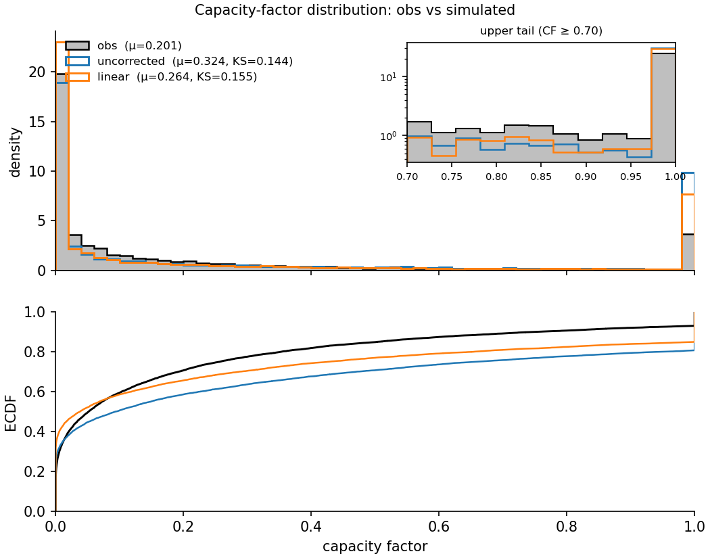
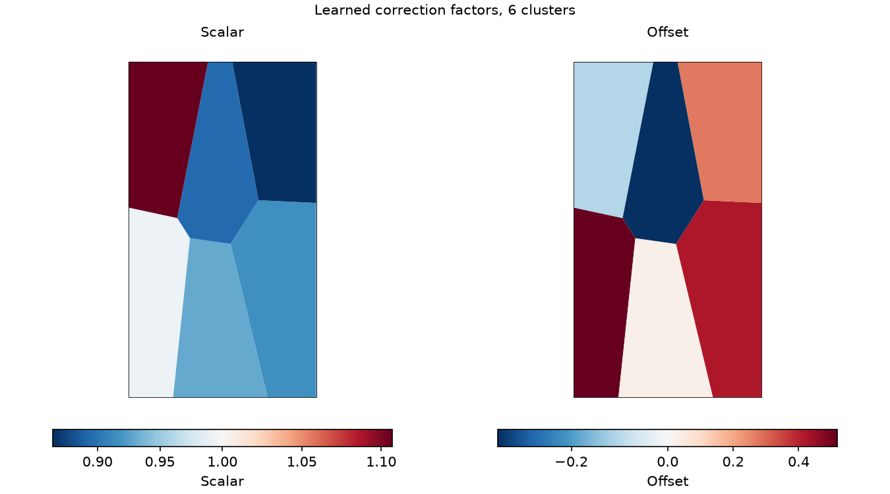
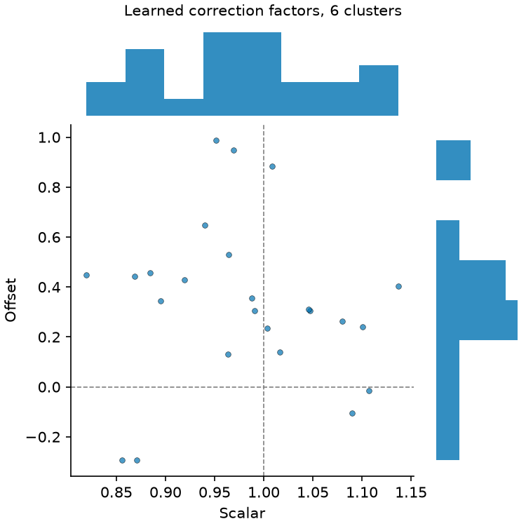
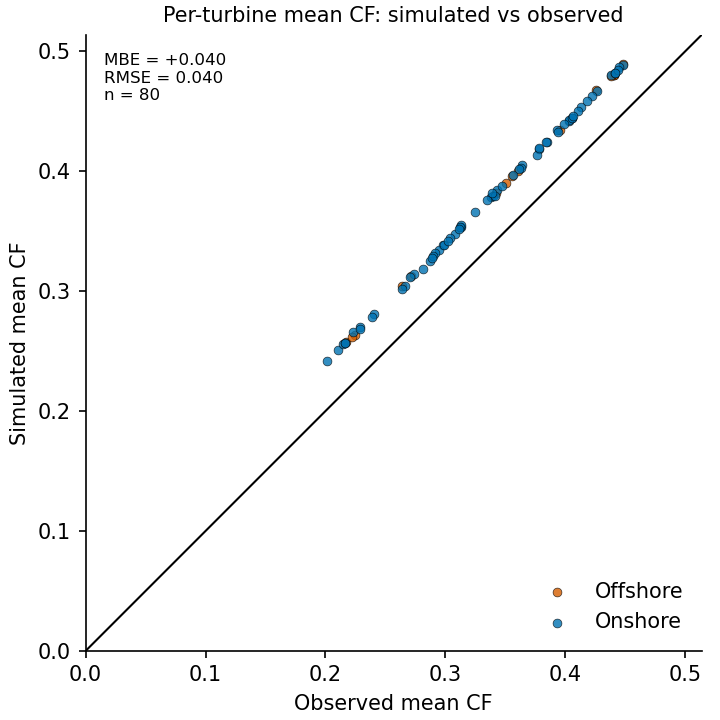
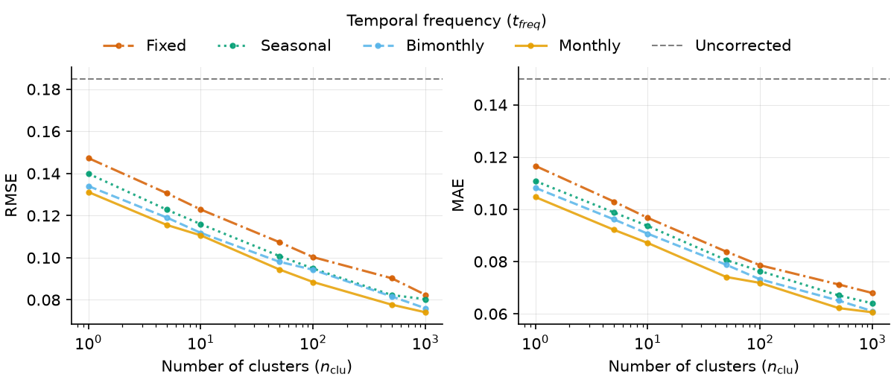

# Visualisation

`vwf.viz` turns a run's outputs into diagnostic figures: how well the corrected
simulation reproduces the observed capacity-factor distribution, what the
correction learned spatially, and how error responds to cluster count and
temporal resolution.

`load_results()` reads any PyVWF run directory back into a `Results` object, so
the plot functions are self-contained. A data-free reproduction of every figure
below is in [`examples/viz_demo.py`](../../examples/viz_demo.py).

## Distribution and QQ

```python
from vwf.viz import load_results, plot_cf_distribution, plot_qq

res = load_results("outputs/DK", country="DK", year=2020)
sims = {"uncorrected": res.uncorrected, "linear": res.corrected[(1000, "bimonth")]}

plot_cf_distribution(res.obs, sims).savefig("cf_distribution.png", dpi=150)
plot_qq(res.obs, sims).savefig("cf_qq.png", dpi=150)
```



The legend annotates each series with its mean and KS distance to observed. The
tail inset zooms into `CF >= 0.7`, so differences in the upper tail stay visible.

## What the correction learned

`plot_correction_factor_map()` colours each cluster's Voronoi cell by its learned
scalar and offset, on a diverging scale centred at the neutral value (scalar 1,
offset 0), so over- and under-correction read at a glance. Pass the *training*
fleet, so the deterministic clustering reproduces the cluster IDs the factors
were fitted on.

```python
from shapely.geometry import box
from vwf.viz import plot_correction_factor_map

fig = plot_correction_factor_map(
    res.factors[(1000, "bimonth")],       # one (n_clu, time_res) configuration
    res.train_turb_info,                  # the fleet the factors were fitted on
    boundary=box(8.0, 54.5, 13.0, 57.8),  # optional clip: any shapely geometry,
)                                         # GeoDataFrame, or path to a GeoJSON
```



`plot_factor_joint()` shows the same factors in factor space: scalar against
offset with marginal histograms and guides at the neutral values. Tight
clustering around (1, 0) means the reanalysis needed little correction.

```python
from vwf.viz import plot_factor_joint

plot_factor_joint(res.factors[(1000, "bimonth")]).savefig("factor_joint.png", dpi=150)
```



## Per-turbine bias

`plot_sim_vs_obs()` scatters each turbine's mean simulated capacity factor
against its mean observed one, so distance from the diagonal is that turbine's
bias. The panel is annotated with fleet-level MBE and RMSE. It reads the wide
capacity-factor files a run writes to disk.

```python
import pandas as pd
from vwf.viz import plot_sim_vs_obs

cf_dir = "outputs/DK/results/capacity-factor"
fig = plot_sim_vs_obs(
    pd.read_csv(f"{cf_dir}/DK_2020_unc_cf.csv"),
    pd.read_csv(f"{cf_dir}/DK_2020_obs_cf.csv"),
    turb_info=res.turb_info,   # optional: colour onshore/offshore
)
```



## Choosing `n_clu` and `time_res`

`plot_error_vs_clusters()` takes the tidy metrics table written by
`scripts/analysis/evaluate_all_pyvwf_runs.py` and plots error against cluster
count, one line per temporal resolution, with the uncorrected error as a
reference.

```python
import pandas as pd
from vwf.viz import plot_error_vs_clusters

metrics = pd.read_csv("outputs/DK/pyvwf_evaluation_metrics.csv")
plot_error_vs_clusters(metrics[metrics["country"] == "DK"]).savefig("error_vs_clusters.png", dpi=150)
```



Bear in mind that with one held-out test year per region, the shape of this
curve is more informative than its exact minimum.
